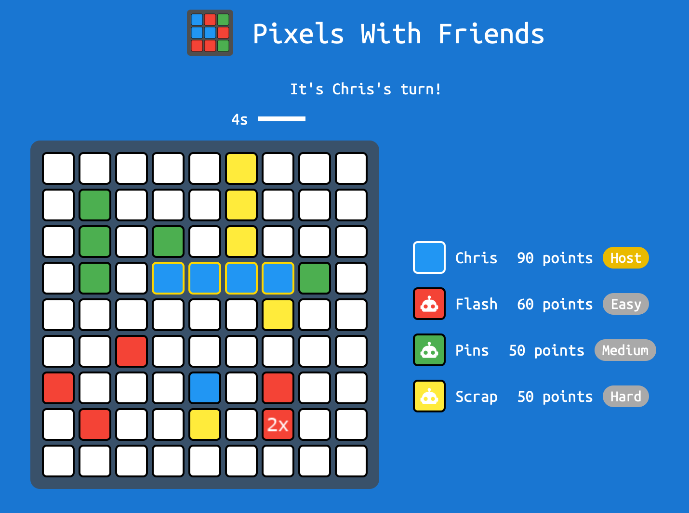
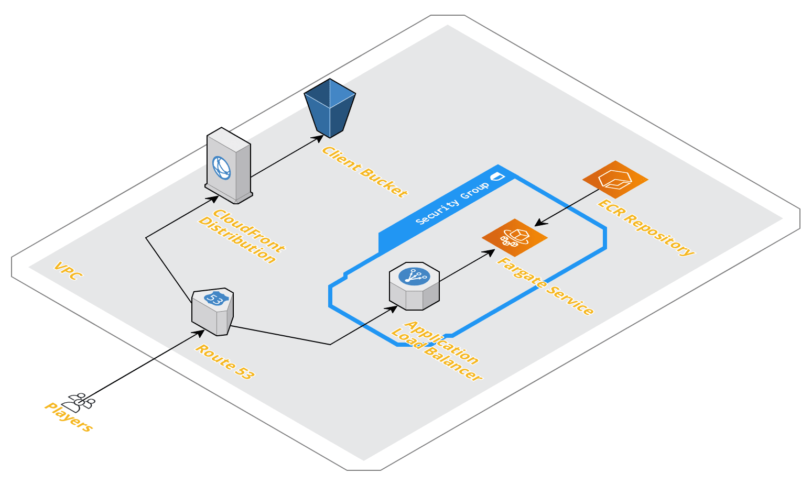

# pixels-with-friends

Web based party game built with React including backend session server.



## Server

The server is a Node.js Express server exposing an API for use by the client to
open and join rooms, add players and bots, tweak their color and difficulty,
and place tiles. See `server/src/index.js` for APIs available.

It can be started on port `5500` as follows:

```bash
cd server
npm ci

npm start
```

## Client

The client is a React-based app with pages for each stage - lobby, in game, and
game end. It can be built as follows:

```bash
cd client

# Set configuration to point to game server
export SERVER_URL=localhost
node scripts/createConfig.js

# Build the client app
npm ci
npm run build

# Serve locally
python3 -m http.server
```

## Deployment



Infrastructure in AWS includes a Fargate ECS service for the game server, and a
CloudFront + S3 bucket website for the client files.

Deployment is done using a mix of Terraform and the AWS CLI:

```bash
./deploy.sh
```


## Bugs

- Players rejoin get tiles back, but not score
- Bots do not attempt to perform or defeat capture moves
